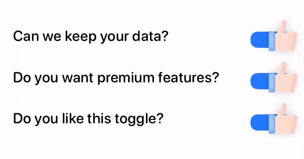

# FxckToggle

Description: A **ToggleStyle** that gaves a middle finger !



### Usage

Define `@State` property to store your **Toggle** state

```swift
@State private var isDumb = true
```


Create a **SwiftUI Toggle**, and apply my `FxckToggleStyle()`

```swift
Toggle("Are you dump?!", isOn: $isDumb)
    .toggleStyle(FxckToggleStyle())
```

